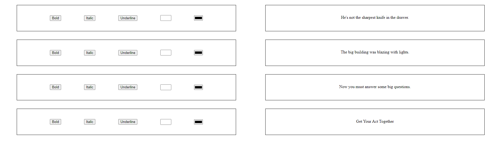
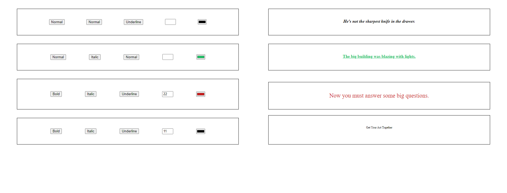

# Problem Statement 1

## Build a responsive UI grid :

> Here Bold, Italic, Underline, font-size, and color are input buttons that change the properties of the sentences which are horizontally aligned with the buttons.

> Ex. If I click on the “bold” button on the first-row first column, then the text “He's not the sharpest knife in the drawer.” becomes bold.

- Bold: Button (Should make the text bold)
- Italic: Button (Should make the text italic)
- Underline: Button (Should underline the text)
- Font-size: HTML input type=number (Should change the font-size of the text)
- Color: HTML input type=color (Should change the color of the text)

<br>
<br>

## **Setup Guide**:-

Go to root and Open another terminal window

```
cd problem1
```

Install Dependencies:-

```
npm install
```

Run Server:-

```
npm start
```

<br>
<br>

## **Demo Images**:



